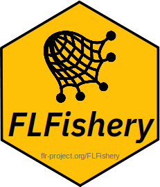

# FLFishery 

## Overview
FLFisheries contains classes that represent a fishery, a group of vessels operating with the same exploitation pattern in terms of gear, space and time.

To install this package, start R and enter:

	install.packages("FLFishery", repos="http://flr-project.org/R")

or download from the [FLFishery releases page](https://github.com/flr/FLFishery/releases/latest)

## Documentation
- [Help pages](http://flr-project.org/FLFishery)

## Build Status

## Releases
- [All release](https://github.com/flr/FLFishery/releases/)

## License
Copyright (c) 2015-2022 European Union. European Commission Joint Research Centre D.02. Released under the [EUPL 1.1](https://joinup.ec.europa.eu/community/eupl/home).

## Contact
You are welcome to:

- Submit suggestions and bug-reports at: <https://github.com/flr/FLFishery/issues>
- Send a pull request on: <https://github.com/flr/FLFishery/>
- Author: Iago Mosqueira (WMR)/
- Maintainer: Iago Mosqueira <iago.mosqueira@wur.nl>
